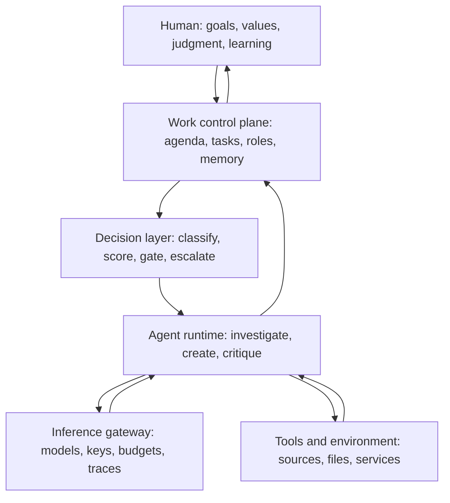
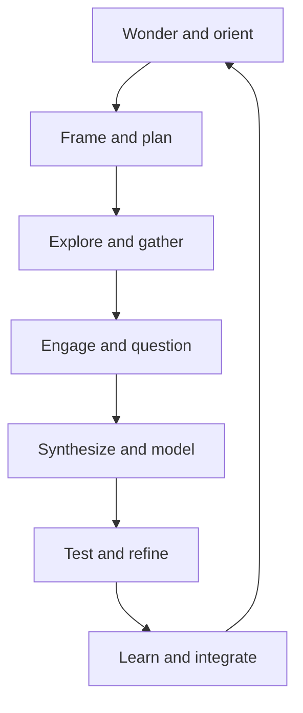
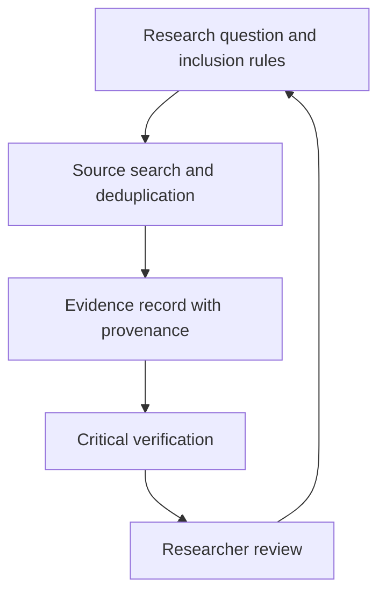

# The Personal Agentic OS

## A draft whitepaper on control planes, decision models, and human learning

**Draft 0.2 · September 2026**  
**Scope:** Conceptual framework and exploratory design; product details reflect documentation reviewed September 28, 2026.

> **Thesis.** A Personal Agentic OS should help a person pursue chosen goals, notice what matters, investigate evidence, exercise judgment, and learn. Its work control plane, bounded decision layer, and inference gateway coordinate AI resources in service of that human process. The measure of success is a more capable human, not merely more autonomous software.

## Executive summary

An AI assistant responds to a request. An agent can use tools to complete a task. A **Personal Agentic OS** is a proposed architecture in which persistent work, specialized decisions, model access, and human reflection form one revisable system. Its **organizational control plane** maintains goals, projects, roles, work records, approvals, and continuity. Its **decision layer** makes bounded classifications, scores, and escalation recommendations. Its **inference gateway** provides a stable route to model providers with authentication, routing, budgets, fallbacks, and observability. Runtimes and tools execute the work; the human sets direction, interprets evidence, and decides what to value. [1–6, 15–21]

Paperclip and Multica exemplify the work layer. Jev, Kev, Laya, NLI models, and the Ollaya local runtime suggest a different primitive: fast, typed decisions that can triage material before an expensive generative agent is invoked. Bifrost and LiteLLM exemplify gateways that can govern generative model traffic. These are complementary roles, not interchangeable products. The decision models do not determine human values, and the gateway does not decide what a project is for. [15–21]

The core use case in this revision is **research as a learning loop**. A person wonders, frames a question, encounters evidence, tests an interpretation, and revises their understanding. Agents can widen the search, expose contradictions, rehearse alternative explanations, and preserve a trail of how a question evolved. The system should strengthen curiosity, expertise, creativity, and judgment without quietly substituting machine judgments for the person's own.

This paper develops the layered architecture, applied workflows, control requirements, a bounded prototype, and a research agenda. Descriptions of products are sourced to current documentation; the Personal Agentic OS, its interaction design, and its hypotheses are proposals for investigation.

## 1. Why another software layer is emerging

The chat interface is effective for a question with a bounded answer. It becomes strained when work continues over weeks, depends on changing sources, involves several tools or specialists, and must be audited later. A capable model still needs answers to organizational questions: What is the goal? Who owns this task? What evidence is authoritative? Which actions are permitted? What counts as finished? Who reviews the result? What happens if the worker is interrupted?

These are not solved merely by adding more agents. Ten model sessions can multiply context loss, conflicting edits, duplicated effort, cost, and false confidence. The control plane exists to make the work itself durable and governable.

This is a conceptual architecture, not a claim that all systems implement every element. Tool protocols such as MCP address a different boundary: they expose external resources and actions to applications and models. A work control plane decides when and why those capabilities are used, by whom, within which task and review policy. A decision layer may act before, during, or after an agent run; gateway calls may occur at several points. The diagram expresses responsibility, not a mandatory linear request path. [11]

### Working definition

A **control plane for agentic work** is a persistent coordination system that binds goals and tasks to agent identities, execution environments, tools, permissions, human decisions, and observable outcomes. “Meta-agentic harness” is a useful informal label, but neither term is yet a stable industry category.

A system need not contain multiple agents to benefit from a control plane. One agent with a durable work queue, carefully scoped permissions, and clear review gates may outperform an elaborate agent hierarchy.

## 2. The essential primitives

| Primitive | The question it answers | Minimum useful record |
|---|---|---|
| Goal and scope | Why does this work exist? | desired outcome, owner, constraints, stop condition |
| Work item | What exactly needs doing? | status, assignee, input, due context, acceptance criteria |
| Agent identity | Who is responsible across runs? | role, instructions, skills, permissions, history |
| Runtime and run | Where and when was work executed? | model/tool, environment, start/end, result, cost |
| Context and sources | What may the worker rely on? | source locations, versions, provenance, freshness |
| Policy | What may it read, change, send, or spend? | permissions, budgets, escalation triggers |
| Review | What needs human judgment? | decision request, evidence, reversibility, deadline |
| Artifact | What was produced? | file or record, version, links to supporting evidence |
| Audit and feedback | Can we reconstruct and improve the process? | decisions, actions, errors, evaluation results |

The critical distinction is **identity ≠ runtime ≠ model**. An agent named “Literature Scout” can persist as a role and work history even while its underlying model, tool, or computer changes. Multica describes this separation explicitly through agent, runtime, and run; Paperclip similarly maintains organizational agents whose heartbeats invoke an underlying adapter. [2, 4]

Persistence should be selective. A durable agent needs stable instructions and references to authoritative material, not an ever-growing dump of conversation history. Old decisions require dates, ownership, and a path to revision. Otherwise organizational memory becomes organizational misinformation.

## 3. A layered Personal Agentic OS

The word *control plane* can refer to different scopes. In this paper, **work control plane** names the organizational layer (Paperclip or Multica); **inference gateway** names the provider access and resource layer (Bifrost or LiteLLM). A gateway vendor may call its product a control plane for inference. That is accurate within its scope, but it does not make the gateway the owner of the human research agenda.

| Layer | Primary responsibility | Illustrative components | What it must not silently decide |
|---|---|---|---|
| Human | Curiosity, values, goals, interpretation, consequential choices, learning | Researcher, teacher, household member | Delegation of authorship or responsibility |
| Work control plane | Persistent agenda, tasks, roles, state, approvals, artifacts | Paperclip, Multica | Whether machine output is meaningful to the person |
| Decision layer | Bounded labels, scores, novelty/contradiction flags, abstention, escalation | Jev, Kev, Laya, NLI; Ollaya as a local serving option | Truth, moral priority, or final authorization |
| Agent layer | Open-ended investigation, synthesis, coding, critique, tutoring | Agent runtimes and skills | Use of tools outside delegated scope |
| Inference gateway | Stable API, model/provider routing, keys, budgets, fallbacks, logging | Bifrost, LiteLLM | The research question or educational goal |
| Tool and knowledge layer | Access to sources, citations, notes, code, data, communications | MCP, APIs, Zotero, browser, notebooks | Authority to treat retrieved text as instructions |
| Execution environment | Process, files, isolation, credentials, reproducibility | Workstation, VM, container, server | More access than its OS and service permissions allow |

The table separates *functions*, not necessarily processes. A product may span several functions, and a prototype may combine layers in one application. Yet the distinctions are valuable for diagnosis: a false-positive novelty flag is a decision-layer problem; a wrong model selected despite a privacy rule is a gateway/policy problem; a draft sent without approval is a work and action-authorization problem.

### Decision models as bounded attention filters

TypeSafe describes Jev as answering typed questions with probabilities rather than generating prose. Open alternatives include Kev and Laya. Ollaya is a local daemon and API for serving several such models, including NLI and classification families; it is **not itself a single decision model**. Their suitability for a given research task remains empirical. [15–18]

A proposed decision contract might return `question`, `candidate_label`, `score`, `model_version`, `evidence_pointer`, and `abstain_or_escalate`. The software then applies a versioned rule. For example: if a new paper is probably in scope, place it in a review queue; if the score is ambiguous or it conflicts with the existing map, ask for human attention; never allow a classifier alone to dismiss a paper permanently. Probabilities are model outputs, not automatically calibrated guarantees. Thresholds must be tested on the user's own labeled examples, across changing topics and source types. [22, 23]

A decision layer can also route *work*: select an inexpensive extraction path for routine items, summon a deeper agent for novel evidence, or ask a human to clarify a value-laden question. Such routing must carry the reason, confidence, and downstream effect into the work record. A fast decision that hides a valuable outlier is costly even if its per-call price is low.

### Gateway as resource and access infrastructure

Bifrost and LiteLLM expose a common interface over multiple providers and document routing, virtual keys, cost tracking, budgets, and fallbacks. They can help a Personal Agentic OS use an appropriate model, contain spending, and observe usage. [19–21] The earlier personal infrastructure plan selected Bifrost as the stable endpoint, with a private Tailscale ingress, an internal `copilot-api`, OpenCode Go as a prepaid workhorse, and OpenRouter as metered fallback. That is a **deployment hypothesis** for this prototype, not a universal requirement.

The work layer should attach project and sensitivity metadata to requests; the gateway should enforce provider/model access and report cost and route decisions back to the work record. A decision model served outside an OpenAI-compatible generative endpoint may need a separate client or adapter; one gateway URL should not be assumed to handle every decision-model API. The system should record the **effective** provider and model after a fallback, not merely the requested alias. For privacy, the content and retention of gateway traces need their own policy.

### An example crossing the layers

| Step | Layer doing the work | What returns to the human record |
|---|---|---|
| A person asks whether a new finding changes a research direction | Human + work plane | Question, motivation, current working model |
| New papers arrive | Tool + environment | Source identifiers, timestamps, provenance |
| A bounded model screens relevance and possible contradiction | Decision layer | Scores, labels, uncertainty, version |
| An agent reads the strongest candidates and challenges the current model | Agent + gateway | Evidence, counterarguments, actual model and cost |
| The system presents a claim and its strongest rival explanation | Work plane | A decision item with source links and unresolved questions |
| The person revises the agenda or holds it open | Human | Rationale, changed understanding, next question |

This sequence makes **human intervention a cognitive contribution**, not just an approval click.

## 4. Two live designs: Paperclip and Multica

### Paperclip: goals, delegation, and governance

Paperclip describes itself as the layer above model runtimes: an organization with goals, an org chart, a task board, budgets, approvals, and an audit trail. A human board operator sets direction; a CEO agent can propose strategy and delegate work, subject to approval for important decisions. Agents wake for episodic execution rather than remaining continuously active. The company boundary separates goals, agents, tasks, and budgets. [1–3]

The design makes authority unusually visible. Budgets can pause work at a limit; its connector action settings include **Allowed**, **Ask first**, and **Off**. This creates an explicit difference between drafting a message and sending it. The platform also documents routines and external connectors, although actual availability depends on version, configuration, and provider authorization. [1, 3, 7]

Paperclip's organizational metaphor is best understood as a policy and delegation structure. It may fit workflows that begin with a broad mission and recur across projects. The metaphor can also invite unnecessary layers of artificial management; the number of agents should be justified by distinct work and measurable benefit.

### Multica: a shared workspace for people and agents

Multica places issues, projects, comments, and assignments at the center. An agent can be assigned an issue, mentioned in a comment, or included in a squad. A connected runtime claims a run and invokes the configured AI tool; the durable issue and agent history remain in the workspace. Autopilots can start recurring work from schedules or webhooks, either creating an issue or running an agent directly. Skills package a `SKILL.md` with optional scripts, templates, and reference material for reuse. [4–6, 8]

A squad's leader routes work to relevant members; assigning an issue to a squad does **not** automatically run every member in parallel. The documentation presents the leader as a coordinator that delegates and later reevaluates progress. This matters because the presence of several agents is not evidence of independent verification or faster execution. [9]

Multica's present center of gravity is AI coding tools and issue-based collaboration. Its security documentation is direct: the platform does not provide a general filesystem sandbox for local runs. The daemon's OS account is a real access boundary. An experiment involving private material should use an appropriately isolated account, VM, or other tested containment. [10]

### Comparison at the level of design

| Dimension | Paperclip | Multica |
|---|---|---|
| Organizing metaphor | AI company and board | Shared human–agent workspace |
| Starting object | Goal, company, delegated tasks | Issue or project assignment |
| Coordination | Managerial reporting and delegation | Assignees, mentions, squads |
| Repeated work | Routines | Autopilots |
| Human intervention | Board and connector approvals, budget overrides | Issue review, assignment and access controls |
| Execution | Agent adapters and heartbeats | Connected runtime claims runs |
| Strongest exploratory fit | Governed recurring knowledge work | Collaborative project and repository work |
| License note | Main repository states MIT | Custom Multica License incorporates Apache 2.0 with additional conditions [12, 13] |

These are analytical emphases, not exclusive feature boundaries. Both products change rapidly. A deployment decision should check the current documentation, license, adapter support, connector permissions, and local security model rather than assume this snapshot is complete.

## 5. Research investigation as a human learning loop

The end of research investigation is not simply a report. It is a change in what the researcher knows, can question, can explain, and can do. The Personal Agentic OS therefore needs to represent a **living research agenda**: working questions, assumptions, competing accounts, evidence, uncertainty, methodological choices, decisions, and reflections on what was learned.

| Human movement | Agent contribution | Decision or record that preserves learning |
|---|---|---|
| Wonder and orient | Surface adjacent concepts, tensions, promising anomalies | Why the question matters now |
| Frame and plan | Generate alternative framings and search strategies | Chosen scope, assumptions, rejected framings |
| Explore and gather | Search, deduplicate, map citations, track new material | Provenance and reasons for inclusion |
| Engage and question | Act as tutor, interlocutor, skeptic; pose contrasts | Researcher's own questions and provisional interpretation |
| Synthesize and model | Compare mechanisms and competing explanations | Claim–evidence map with counterevidence |
| Test and refine | Propose falsifiers, sensitivity checks, small studies | What would change one's mind; test outcome |
| Learn and integrate | Prompt explanation in one's own words and transfer to new case | Reflection, revised model, next questions |

The loop is intentionally **human-centered rather than fully automatable**. Agent scaffolding can increase exposure to relevant evidence, help a person notice contradictions, and ask productive questions. The researcher must still encounter enough primary material to form and defend an interpretation. A summary can support that encounter; it cannot stand in for it.

A useful interface might show a *question notebook* beside an *evidence ledger*: what I currently think, what supports it, what challenges it, how confident I am, and what I want to investigate next. The system can periodically ask the person to explain a concept without looking at its synthesis, apply it to a new case, or decide between rival interpretations. Corrections and surprising findings revise the agent's future search policy. This is a learning loop rather than a content production pipeline.

The decision layer complements the loop by spotting candidate novelty, contradiction, relevance, and ambiguity at scale. It should present these as invitations to inspect evidence, with an abstain path, rather than convert a score into a claim of truth. The work plane remembers open questions and unresolved disagreements; the gateway allocates stronger models when a harder analysis warrants their cost. Human attention is spent on the material most likely to change understanding.

## 6. Human interaction is the real design challenge

A control plane should compress machine activity into a small number of well-formed human decisions. The interface is less about watching agents “think” and more about making intent, status, evidence, and authority legible.

A useful decision item answers five questions at a glance:

1. **What is proposed?** Include the exact change or external action.
2. **Why now?** Link it to the goal, task, and evidence.
3. **What could go wrong?** State uncertainty, scope, and reversibility.
4. **What happens if I decline or defer?** Show the next safe state.
5. **What decision is requested?** Approve, edit, reject, or ask for more evidence.

| Lane | Example | Default handling |
|---|---|---|
| Observe | New article found; diagnostic report generated | Log and summarize |
| Review | Synthesis, slide deck, comparison brief | Human checks quality before use |
| Decide | Choose research direction or purchase candidate | Human chooses among evidence-backed options |
| Authorize | Send external email, publish grades, buy item | Human approves exact action before execution |
| Investigate | Conflicting sources, failed run, suspicious instruction | Pause dependent work and surface context |

The platform should minimize review fatigue by grouping routine observations, suppressing duplicates, and escalating only material changes. An approval queue that grows faster than it can be processed is a failed control mechanism. The aim is **bounded autonomy with well-placed attention**, not autonomy as a goal in itself.

## 7. Applied patterns

The following are **proposed workflows**, not claims that either product ships them as turnkey templates. Each requires suitable data access, domain rules, and human oversight.

### Research: a horizon scan with an evidence trail

A weekly scout searches an explicitly defined source set, deduplicates candidates, and records bibliographic identifiers, dates, abstracts, and links. A decision model proposes relevance, novelty, or contradiction flags with an abstain route; a human-reviewed sample estimates missed items. A critical agent checks the strongest candidates against the actual text where access permits, flags uncertain claims, and compares rival explanations. The researcher reads selected primary material, updates the question notebook, and decides which papers change the agenda. The gateway records which generative models were called and why.

The evidence record should preserve search queries, databases, timestamps, screening reasons, source versions, and citation identifiers. It must distinguish a search-result snippet from a read full text. For systematic work, the workflow must be adapted to the relevant reporting and methodological standards; an agent-generated summary is not a substitute for reproducible screening.

**Useful measures:** relevant papers found per review hour, missed known papers, false positives, citation accuracy, cost, discoveries that changed a project decision, and the researcher’s ability to explain and apply a new insight later.

### Teaching: course consistency and accessibility checks

A course agent compares the syllabus, schedule, assignment instructions, rubrics, slides, and LMS entries. It produces a discrepancy list with exact locations and proposed repairs. A second pass checks document structure, alt text, captions, links, and reading availability. The instructor reviews proposed edits and publishes them.

Keep student records and submitted work within institutional rules. Grade decisions, individualized feedback with consequences, and student-facing communication should have explicit human review and appropriate access controls. A low-risk first pilot can use only public course materials and synthetic examples.

**Useful measures:** discrepancies caught before release, instructor review time, accessibility defects corrected, and student confusion reports.

### Service: meeting preparation and follow-through

A service agent assembles the agenda, prior minutes, relevant policy text, and open commitments into a brief. It marks which statements come from documents and which are its inferences. After a meeting, it proposes action items and follow-up drafts. The participant approves commitments and sends communications through the institution's authorized channels.

**Useful measures:** missed commitments, preparation time, correction rate, and whether the brief actually improved a decision.

### Home: durable vehicle and purchasing records

A household workspace could retain service dates, registration deadlines, charging notes, diagnostic observations, and unresolved questions for a vehicle. A purchase workflow could collect candidates, current prices, warranty terms, owner evidence, and a decision matrix. Price and availability need a fresh check before a transaction. Payment, booking, disclosure of personal data, or contact with a third party should require explicit authorization.

The benefit is continuity: the next comparison starts from a maintained record rather than a reconstructed chat. The record should also make it easy to correct an earlier assumption and see which downstream recommendations used it.

## 8. Failure modes and control requirements

| Failure | Mechanism | Practical control |
|---|---|---|
| Coordinated error | Several agents repeat the same weak source or model assumption | Independent primary-source checks and explicit adversarial review |
| Goal drift | Subtasks optimize visible activity rather than the original objective | Acceptance criteria, periodic goal review, stop rules |
| Context decay | Old instructions and facts persist after circumstances change | Versioned sources, expiration, owner and date on decisions |
| Prompt injection | Untrusted content attempts to issue instructions through a tool result | Treat source text as data; isolate capabilities; review sensitive actions |
| Permission spillover | A local run inherits broad OS or connector access | Dedicated runtime identity, least privilege, action-level restrictions |
| Review theater | Approval requests hide the actual effect of an action | Show exact payload, affected resources, evidence, and rollback path |
| Cost loops | Scheduled work or agent handoffs generate repeated runs | Budgets, concurrency limits, deduplication, circuit breakers |
| Output flood | Plausible artifacts exceed human capacity to inspect | Escalation thresholds, sampling, measurable quality gates |
| Decision-model miscalibration | A numeric score is treated as reliable outside its tested domain | Local labels, calibration plots, abstention and drift checks |
| Invisible fallback | A gateway silently routes sensitive or demanding work elsewhere | Allowed-provider policy, effective-route logging, fail-closed cases |
| Learning displacement | The person accepts a fluent synthesis without forming an interpretation | Primary-source engagement, self-explanation and transfer checks |
| Data leakage | Private records flow to an external model or service | Data classification, approved providers, retention review |

The MCP project's security guidance documents risks around authorization and tool use, but a secure tool connection alone does not guarantee safe decisions about the content an agent reads or the action it chooses. The control plane needs policies at both the technical and work levels. [11, 14]

A further challenge is **evaluation independence**. If the same model generates a finding and validates it using the same source summaries, the second pass may add little. Review must inspect primary evidence where possible and use tests or independent methods appropriate to the task.

## 9. An evaluation framework for real adoption

A pilot should begin with a baseline performed by the person or current workflow. Measure outcomes over repeated cycles, not one impressive demo.

| Axis | Question | Possible measure |
|---|---|---|
| Quality | Is the result correct and useful? | blinded review, error rate, missed items |
| Attention | Does it reduce interruption? | review minutes, approval count, items escalated |
| Continuity | Can work resume reliably later? | context reconstruction time, stale-state errors |
| Timeliness | Does it act when needed? | latency from trigger to usable brief |
| Economics | Is the gain worth the expense? | model and infrastructure cost per accepted output |
| Control | Were boundaries respected? | unauthorized attempts, interventions, audit completeness |
| Recoverability | Can failures be diagnosed and repaired? | mean time to identify failure, rollback success |
| Learning | Does the person understand more afterward? | delayed explanation, transfer task, quality of new questions |
| Agency | Are goals and values still human-directed? | rationale ownership, overrides, perceived control |
| Triage | Do small decision models focus attention without losing signal? | recall at review budget, calibration, abstention rate |

The denominator matters. “Twenty reports produced” is not a success measure if only two were read. Track **accepted, decision-relevant outputs per unit of human attention and cost**. Record failures and near misses, including confident but unsupported claims.

### A bounded six-week pilot

**Weeks 0–1:** Select one workflow, such as a weekly literature horizon scan. Define sources, inclusion rules, a question notebook, excluded data, a delayed learning check, and a baseline from the existing process. Start with one worker and one review step. Record a small labeled set for decision-model evaluation; use a spending cap and read-only access where possible.

**Weeks 2–3:** Run in shadow mode. The decision layer proposes triage labels; the agent produces evidence records and a draft brief; the human uses the normal process. Compare missed findings, calibration, explanations, and time spent reviewing. Log gateway routes and costs. Correct the method before adding more agents.

**Weeks 4–6:** If shadow results are credible, let the workflow maintain its own queue and surface material findings or uncertain cases. Ask the researcher to explain and apply at least two findings after a delay. Keep publication, communication, purchase, grade, and policy decisions with the human. Compare learning, attention, quality, and costs against the baseline; continue, redesign, or stop.

A successful pilot yields a versioned workflow specification, source and permission inventory, sample accepted and rejected outputs, cost log, and a short retrospective. Those artifacts are more valuable than a large cast of named agents.

## 10. Where the category may go

The following are **forecasts**, not current product guarantees.

1. **Portable work organizations.** The reusable package may include roles, skills, permissions, workflows, evaluation criteria, and templates. A “literature review team” becomes more meaningful than a single “research bot.”
2. **Model routing beneath stable identities.** A decision layer may select the depth of work while a gateway selects an allowed provider and model according to cost, speed, privacy, context, and measured reliability. The named role and task history persist.
3. **Attention as a scarce resource.** Interfaces will compete on the quality of their decision inboxes, evidence displays, and escalation rules rather than the visual spectacle of many agent runs.
4. **Policy that follows work.** Permissions, data classifications, and review requirements may travel with a task across agents and runtimes, closing a gap between project intent and tool-level access.
5. **Evaluation as part of the work record.** Systems may store acceptance, correction, and downstream effects alongside outputs so organizations can learn which workflows earn trust.

None of these outcomes is automatic. Portability depends on formats and integrations. Agent identity can become lock-in if history cannot be exported. More autonomous routing can obscure accountability unless a human can reconstruct why a model, tool, or delegated agent was chosen.

## 11. Research agenda for the prototype

The central question is: **Can a layered agentic system improve a person's understanding and capacity for judgment while respecting their goals and values, at a sustainable cost of money and attention?** The following questions turn that aspiration into testable work.

| Theme | Research question | First study or observable |
|---|---|---|
| Human learning | Does an agent-supported investigation improve delayed understanding and transfer compared with a conventional search-and-notes workflow? | Within-person crossover on comparable topics; delayed explanation and novel-case task |
| Epistemic agency | When do summaries and recommendations help a researcher reason, and when do they induce passive acceptance? | Compare evidence-first, synthesis-first, and question-first interfaces; code rationales and source engagement |
| Question formation | Can a persistent agenda produce better questions and research directions over several cycles? | Blind expert assessment of question specificity, novelty, feasibility, and revision history |
| Attention allocation | Can decision models surface high-value anomalies at a fixed human review budget? | Recall/precision curves on labeled paper streams; measure missed high-impact items and abstentions |
| Calibration and drift | Are Jev, Kev, Laya, and NLI judgments calibrated for the user's domains and stable as topics change? | Held-out, time-split labels; reliability diagrams and subgroup error audits |
| Human intervention | Which events warrant human sensemaking, ordinary review, or explicit authorization? | Compare escalation policies by error, interruption, and perceived control |
| Division of labor | Which work benefits from bounded classifiers, open-ended agents, deterministic rules, or direct human action? | Task-level ablations across accuracy, latency, cost, and interpretability |
| Gateway economics | Does decision-first triage reduce spend without sacrificing consequential discoveries? | A/B routing comparison with effective provider, model, cost, latency, and accepted outcomes |
| Privacy and provenance | Can the system preserve source lineage and enforce data boundaries through fallback and delegation? | Inject sensitive and adversarial test cases; audit end-to-end traces and policy violations |
| Values and goals | How should a person express changing priorities without reducing values to a brittle score? | Participatory design; compare preference correction and goal revision over time |
| Long-term trust | Does the system become more useful through correction, or merely more confident and entrenched? | Longitudinal study of overrides, stale assumptions, correction propagation, and trust calibration |

Three hypotheses deserve early falsification:

- **H1 — Learning:** an evidence-first, question-generating assistant produces better delayed explanations than a polished-summary-first assistant, even when the latter is rated more convenient immediately.
- **H2 — Decision layer:** calibrated triage plus abstention preserves nearly all expert-rated high-value findings while substantially reducing the number of items a human reviews. “Nearly all” and “substantially” must be preregistered for the domain and budget.
- **H3 — Gateway and work layer:** model routing under explicit project policy reduces cost per *accepted insight* while retaining provenance and privacy; cost per raw output is an insufficient measure.

### Prototype objects and instrumentation

A minimal prototype needs six versioned objects: **agenda** (human aims and open questions), **evidence item** (source and provenance), **decision record** (typed judgment and uncertainty), **work item** (owner, state, method), **insight** (human-authored or explicitly adopted claim with rivals), and **reflection** (what changed in understanding and what to ask next). Every object should link to its predecessors, and a later correction should identify affected downstream work.

Instrumentation should record model and prompt/version, gateway route and spend, decision schema and threshold, source identifier and access level, human review time, override, and outcome. Private content need not be retained in raw telemetry to measure these. The prototype should support export, correction, and deletion from the outset.

A first build need not choose Paperclip *and* Multica or Bifrost *and* LiteLLM. One work plane, one gateway, a single bounded decision service, and one human research loop are enough to test the central claims. The layers are conceptual commitments; product choices can follow measured fit.

## 12. Conclusion

The promising unit of agentic computing is **work that changes human understanding with continuity**: a question, evidence, bounded machine judgments, responsible execution, rival explanations, and a human interpretation that can be revised. Paperclip and Multica demonstrate organizational routes toward durable work. Decision models can focus attention; gateways can allocate resources. None of these layers alone supplies purpose.

The practical test asks more than whether the system produces more. Does the person ask better questions, understand evidence more deeply, notice when an account fails, and remain able to direct the next step? Can that happen with less wasted attention and compute, while preserving control over data and consequential actions? The durable asset is a living body of methods, evidence, corrections, and human judgment that becomes more capable along with its owner.

---

## Notes and primary sources

These references support descriptions of current products, protocols, and selected empirical concerns. The layered architecture, learning loop, prototype, and forecasts are proposed research directions. Product and benchmark claims should be rechecked before implementation.

1. Paperclip, [What is Paperclip?](https://docs.paperclip.ing/guides/welcome/what-is-paperclip/) and [Key concepts](https://docs.paperclip.ing/guides/welcome/key-concepts/).
2. Paperclip, [Agents](https://docs.paperclip.ing/guides/org/agents/).
3. Paperclip, [Connectors and action permissions](https://docs.paperclip.ing/connectors/).
4. Multica, [Agents, runtimes, and runs](https://multica.ai/docs/agents) and [How Multica works](https://multica.ai/docs/how-multica-works).
5. Multica, [Autopilots](https://multica.ai/docs/autopilots).
6. Multica, [Skills](https://multica.ai/docs/skills).
7. Paperclip, [Costs and budgets](https://docs.paperclip.ing/guides/day-to-day/costs/) and [Approvals](https://docs.paperclip.ing/guides/day-to-day/approvals/).
8. Multica, [Issues and assignment](https://multica.ai/docs/assigning-issues).
9. Multica, [Squads](https://multica.ai/docs/squads).
10. Multica, [Security model](https://multica.ai/docs/security-model).
11. Model Context Protocol, [Specification](https://modelcontextprotocol.io/specification/2025-11-25).
12. Paperclip, [source repository and MIT license](https://github.com/paperclipai/paperclip).
13. Multica, [repository license](https://github.com/multica-ai/multica/blob/main/LICENSE). This is a custom license; review current terms for a contemplated use.
14. Model Context Protocol, [Security best practices](https://modelcontextprotocol.io/docs/tutorials/security/security_best_practices).
15. TypeSafe AI, [Jev and System One overview](https://typesafe.ai/); Spring AI, [TypeSafe integration explanation](https://spring.io/blog/2026/09/21/spring-ai-typesafe-structured-judgment/).
16. Ollaya, [local decision-model runtime](https://github.com/ollaya-dev/ollaya) and [documentation](https://ollaya.dev/docs).
17. Ollaya, [Kev model description](https://ollaya.dev/library/kev).
18. Ollaya, [Laya model description](https://ollaya.dev/library/laya).
19. Bifrost, [source repository](https://github.com/maximhq/bifrost), [virtual keys](https://docs.getbifrost.ai/features/governance/virtual-keys), and [budgets](https://docs.getbifrost.ai/features/governance/budget-and-limits).
20. LiteLLM, [gateway overview](https://docs.litellm.ai/docs/), [virtual keys](https://docs.litellm.ai/docs/proxy/virtual_keys), and [budgets](https://docs.litellm.ai/docs/proxy/users).
21. Bifrost, [provider routing](https://docs.getbifrost.ai/providers/provider-routing); LiteLLM, [routing](https://docs.litellm.ai/docs/routing).
22. Rafe and Das, [*Calibrated Decisions at Scale*](https://arxiv.org/abs/2609.24052) (2026 preprint): an example of domain-specific calibration and human audit, not general validation for research triage.
23. Sun and Xu, [*Type-Safe Is Not Error-Free*](https://arxiv.org/abs/2609.26758) (2026 preprint): reports sensitivity of typed decision heads to option naming; findings need replication and task-specific evaluation.

### Open design choices

- Define the first bounded research domain and human baseline.
- Specify a decision schema and abstention policy before comparing Jev with local alternatives.
- Choose one work plane and one gateway for the pilot, based on actual integration tests.
- Design a human-facing evidence and question notebook that makes uncertainty and learning visible.
