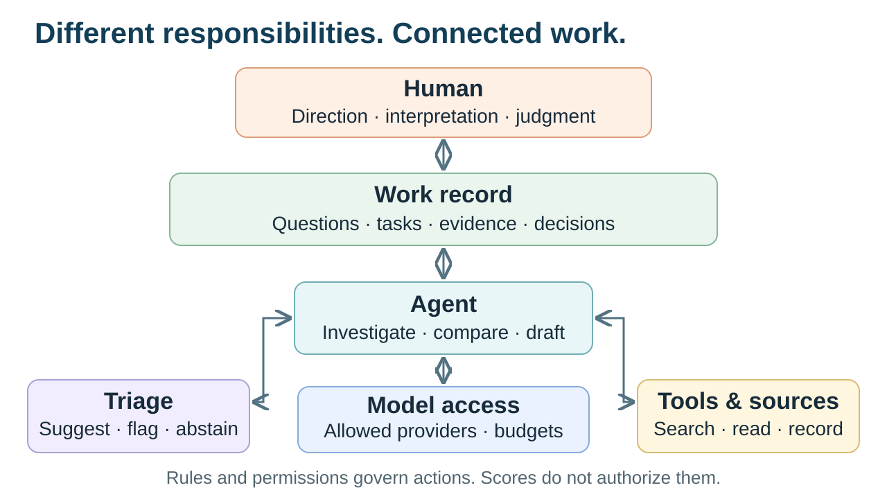
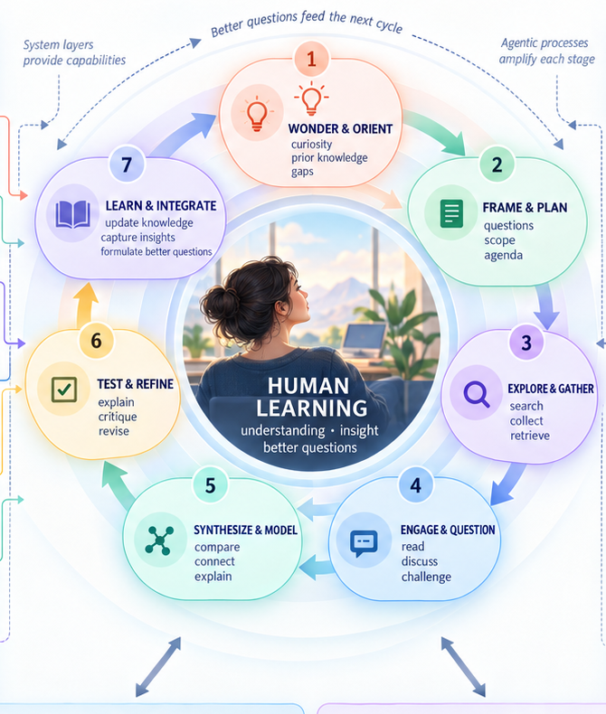

<!-- _class: title -->

# Beyond Chat

## Agentic workflows for research and learning

More capable humans, not merely more autonomous software.

<!--
0:00–1:00 | Opening. This is a proposal for discussion, not a product pitch or a claim that the complete system already works. We will use one research example to ask what persistent AI-supported work could look like, and what would make it worthwhile. About 30 minutes of framing, followed by discussion; interruptions welcome.
-->

---

# A good conversation. Then what?

Next week, can we recover…

- What question were we pursuing?
- Which evidence changed our thinking?
- What remains unresolved?

**The problem is continuity, not just answers.**

<!--
1:00–3:00 | Familiar frustration. Invite a quick show of hands: who has had a useful AI conversation but struggled to resume the work later? Existing chat tools can retain history; the distinction is between stored conversation and an explicit, inspectable record of work, evidence, decisions, and open questions. Do not claim that every chat tool lacks persistence.
-->

---

# From answers to ongoing work

**Chat:** help me think through a question.

**Agent:** use tools to carry out a task.

**Persistent workspace:** keep questions, evidence, tasks, and decisions connected across time.

<!--
3:00–6:00 | Define agent in plain language: software using a model and tools to carry out delegated work. Introduce Personal Agentic OS as a metaphor for a persistent working environment, not a replacement for macOS or Windows. These categories overlap in real products. Multiple agents are optional; one worker with a durable queue and clear review rules may be enough. The proposed advance is integration and continuity, not the invention of workflow management.
-->

---

# One question, followed over time

Could new evidence change how I teach
**corrective feedback in Spanish?**

- Find new studies and keep source records.
- Compare findings, methods, and rival explanations.
- Decide what deserves closer reading or a change in practice.

<!--
6:00–9:00 | Running example, not a demonstrated result. Imagine a weekly literature horizon scan, not a systematic review. The researcher defines the question, source set, and inclusion rules. A scout retrieves candidates; triage suggests relevance and possible contradictions; an agent compares accessible evidence. Distinguish abstracts and snippets from papers actually read. The researcher reads key primary sources and decides whether the evidence applies to this teaching context. No automatic change to teaching practice.
-->

---

# What should come back to me?

**A finding worth examining**

Source links and exact supporting evidence.

**A reason to hesitate**

Methodological limits and competing explanations.

**A question I need to answer**

Does this change my interpretation or my next step?

<!--
9:00–11:00 | Describe a proposed review item rather than another polished report. For example: an apparent disagreement may reflect different learner populations, feedback types, tasks, or outcome measures. Ask the system to show that distinction, not invent a universal recommendation. Keep the evidence trace visible. The output should make a human intellectual contribution possible, not merely ask for approval.
-->

---

<!-- _class: visual -->

<!--
11:00–16:00 | Walk through responsibilities using the same corrective-feedback example. Human sets direction and interprets. Work plane retains the question, source rules, unresolved disagreements, and decisions. A bounded decision service proposes triage labels and can abstain; software rules and human authorization determine permitted actions. An agent investigates and uses tools. A gateway handles allowed model access and budgets, not the research agenda. Evidence and results return to the durable record and the researcher. These are responsibilities, not seven required installations or a mandatory linear request path. One application can combine several functions. Named products are optional examples in the whitepaper, not the organizing principle here. Integration remains an engineering task. Transition: a working architecture does not prove improved learning.
-->

---

<!-- _class: visual -->

<!--
16:00–20:00 | Enlarged center of the author's research-and-learning diagram. Start with wonder and orientation, move through framing, exploration, engagement, synthesis, testing, and integration. Real inquiry can move backward or skip between stages; this is not a validated universal sequence. Focus on engage and question, test and refine, and learn and integrate. Ask what the researcher does at each: read primary evidence, explain a rival account, identify what would change their mind, and formulate the next question. AI can support these activities without replacing them. The key claim remains a hypothesis: a persistent evidence-first workflow might improve understanding, but convenience alone does not establish that.
-->

---

<!-- _class: statement -->

# A better brief is not necessarily better understanding.

Can I explain the finding, challenge it,
and apply it to a new case?

<!--
20:00–22:00 | Contrast two experiences: receiving a fluent synthesis versus examining evidence and revising an interpretation. The system can ask for self-explanation, a competing account, or an application to a new case. These are proposed design and evaluation choices, not evidence that this prototype improves learning. Central tension: the same infrastructure could support inquiry or accelerate intellectual outsourcing.
-->

---

# What could go wrong?

- **Missed surprises:** filtering narrows what we encounter.
- **Shared mistakes:** several agents repeat one weak claim.
- **Passive acceptance:** fluent summaries replace inquiry.
- **Lost control:** private data or actions cross boundaries.

<!--
22:00–26:00 | Give concrete controls without turning this into a security lecture. Sample excluded papers and retain a route for outliers. Check primary sources rather than treating agent agreement as independent verification. Preserve source engagement and ask for the researcher's own explanation. Start read-only with public materials; use approved providers and explicit authorization for consequential actions. More approvals can also create review fatigue: a queue nobody can inspect is not control. Decision-model probabilities are not guarantees of truth or permission. Ask: how do we let a paper change our question when our filter was built around the old question?
-->

---

# Start with one bounded experiment

**One question. One recurring scan. One review step.**

Compare against your current workflow:

- Did we find useful evidence without missing key work?
- Did review take less time, at an acceptable cost?
- Could you explain and apply what you learned later?

<!--
26:00–28:00 | Sketch the six-week pilot from the paper. Weeks 0–1: establish the normal-workflow baseline, sources, permissions, and spending limit. Weeks 2–3: shadow mode, with suggested triage and briefs compared against the normal process. Weeks 4–6: use a bounded queue only if results are credible; check later understanding and transfer. Start with public research materials, one worker, and no automatic external actions. Continue, redesign, or stop based on evidence. Maintenance burden and institutional access also belong in the cost assessment. More reports alone do not count as success.
-->

---

# What would make this worth using?

Where would **continuity** help your work?

What intellectual work must remain **yours**?

What evidence would convince you it improves
**understanding**, not just output?

<!--
28:00–30:00 | Recap and hand off. The proposal is not maximum autonomy; it is persistent, inspectable support for inquiry. Invite faculty to name one workflow and one boundary. Then open discussion, starting with whichever of these questions resonates. Follow-ups if needed: who maintains the infrastructure, who can access it, what institutional rules apply, and what should the system never do without you? Stay on this slide during discussion. Remaining slides are optional reference images, not part of the timed talk.
-->

---

<!-- _class: statement -->

# Reference images

Optional discussion material

Full diagrams follow; detailed labels are best viewed in the original files.

<!--
APPENDIX | Not part of the 30-minute sequence. These are conceptual designs, not screenshots of an integrated working system. The original graphics retain product examples from the whitepaper's drafting process. Product availability and claims have not been independently rechecked for this deck.
-->

---

<!-- _class: visual -->

<!--
APPENDIX | Original research-and-learning overview. The main talk enlarges the center loop because the full diagram is too dense for small Zoom windows. Ollaya is a serving runtime, not another decision model. Gas Town appears in this graphic but is not evaluated in the accompanying whitepaper. Layer relationships indicate conceptual responsibilities rather than a required execution sequence.
-->

---

<!-- _class: visual -->

<!--
APPENDIX | Original architecture illustration. OS is a metaphor. Downward arrows should not be read as the literal request path; agents call gateways and tools, and results feed back into work records and human interpretation. The simplified diagram in the main talk makes these relationships more explicit. Model judgments do not authorize actions. Execution isolation, permissions, and privacy are cross-cutting requirements.
-->

---

<!-- _class: visual -->

<!--
APPENDIX | Original production-oriented research pipeline. Useful contrast with the learning loop: organized outputs are valuable, but do not establish that the researcher understands more. Tooling and sources support the entire workflow, not only the stage after dissemination. Human checkpoints do not substitute for ongoing intellectual engagement or explicit authorization of external actions.
-->
